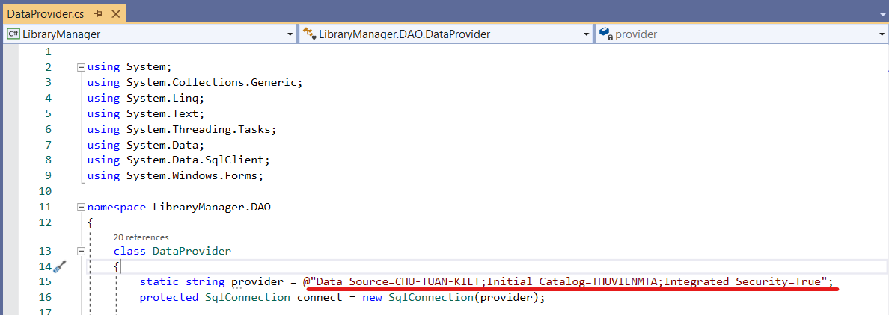
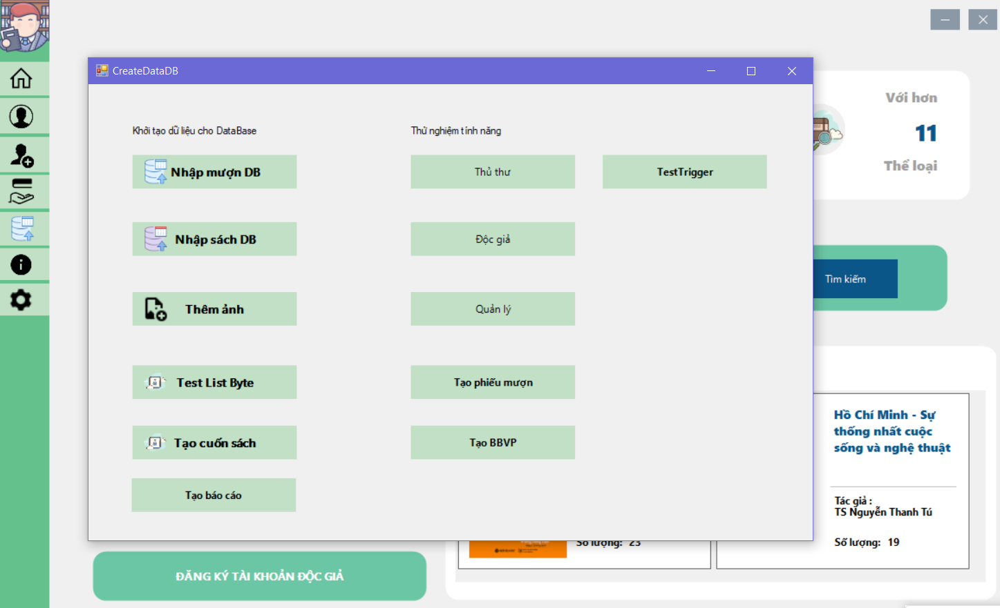

# **Phần mềm quản lý thư viện - THƯ VIỆN MTA**

## Thành viên
* Chu Tuấn Kiệt
* Đinh Thị Ngọc Hòa
* Nguyễn Tiến Trung
* Phan Thu Thủy

## Mô tả chức năng chính
	Phần mềm phục vụ sử dụng cho 3 đối tượng : Độc giả(Khách), Nhân viên thư viện, Quản lý thư viện
	* Độc giả : Tìm kiếm sách, tự tạo phiếu mượn sách; Xem lịch sử mượn trả,...
	* Nhân viên : Quản lý các đầu sách, Quản lý nhập sách, Quản lý mượn trả, lập biên bản vi phạm,...
	* Quản lý : Quản lý nhân viên, Quản lý toàn bộ thư viện,...
	
	

## Cài đặt và sử dụng
### Yêu cầu :
* SQL Server
* Guna UI2 WinForms
* Bunifu v1.5.3
* DevExpress v19.2.5

### Cài đặt database
* Sử dụng file backup [THUVIENMTA.bak](./THUVIENMTA.bak)

* Chỉnh sửa connection string DataProvider tới SQL Server

* Hỗ trợ khởi tạo dữ liệu mẫu cho database

### Một số hình ảnh khác của phần mềm
* Giao diện cho độc giả 

* Giao diện cho nhân viên

* Giao diện cho quản lý 	

* Một số báo cáo 

